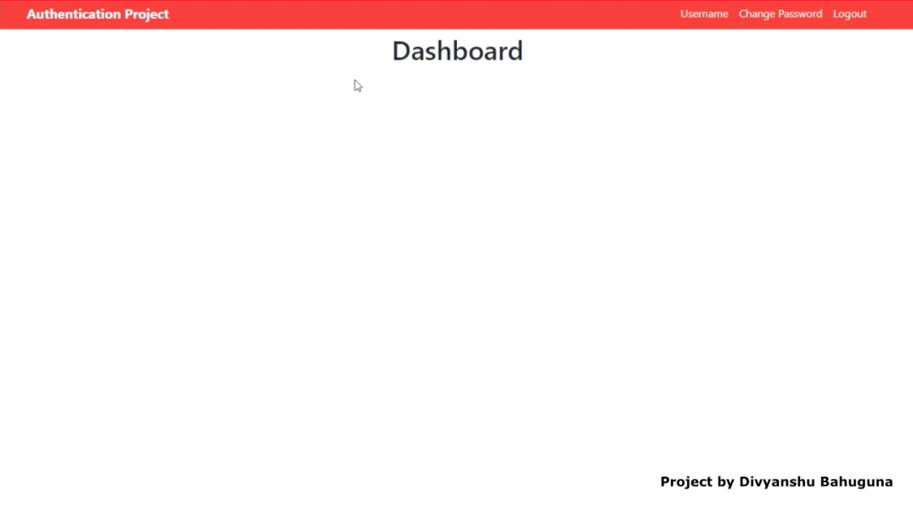

# Navigus-assignment1

**INSTALLING THE PACKAGES :

CREATE JSON PACKAGE :

    npm init
    
**INSTALL NODEMON :

    npm install -g nodemon
    (Require for starting server automtically, don't need to run server everytime with change in file) 
    
**INSTALL EJS (Embedded JavaScript templates ) :

    npm i express ejs --save
    (Require for rendering the html file )
    
**FOR RUNNING THE FILE :

    nodemon app.js ( filename )
    
    
Screenshots of the Appliaction

1. Home Screen

    
    
2. Resgiter Screen

     
     
3. Message After Succesfull Login

     
     
4. Dashboard ( After Login )

     
     
5. Forget Password

     

